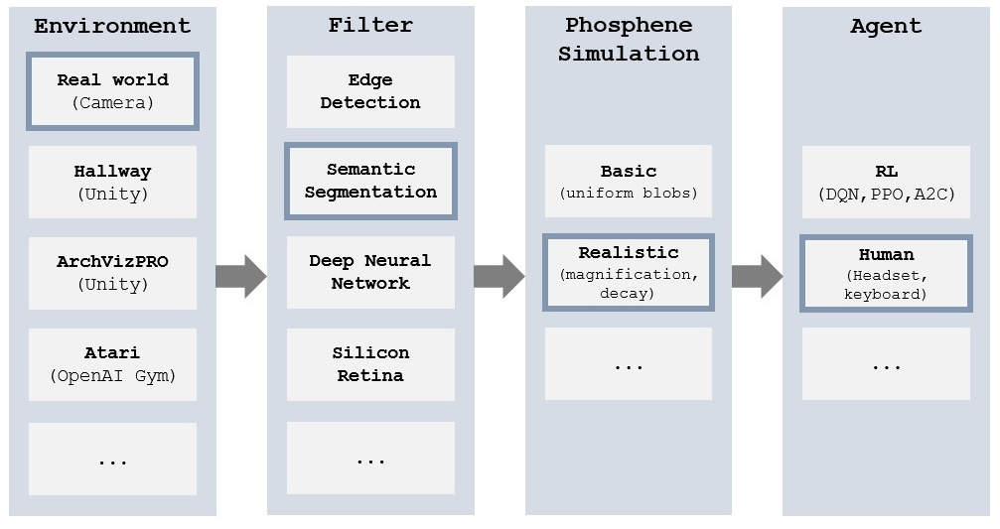

# Phossim
*Creating modular training and evaluation pipelines for simulated prosthetic vision.*

This software provides a structured collection of tools to enable flexible optimization 
and evaluation of models for phosphene vision in a wide range of virtual and 
real environments and using different filtering techniques. It makes use of a highly detailed model of phosphenes 
elicited by cortical stimulation (see the corresponding [preprint](https://www.biorxiv.org/content/10.1101/2022.12.23.521749v1.abstract)). 

## Getting started
Please check the scripts in the `examples` directory. They illustrate the following pipelines: 

| Script                              | Environment                                                                 | Filters                          | Phosphenes                            | Agent                                     |
|-------------------------------------|-----------------------------------------------------------------------------|----------------------------------|---------------------------------------|-------------------------------------------|
| `aihabitat_edge_realistic_human.py` | Navigation in [AI habitat](https://github.com/facebookresearch/habitat-sim) | Grayscale, edges                 | [Dynaphos](https://github.com/neuralcodinglab/dynaphos) | Human (via display + keyboard)            |
| `breakout_e2e_basic_ppo.py`         | Solving the Atari Breakout game                                             | Grayscale, DNN                   | Basic                                 | RL agent trained via PPO                  |
| `breakout_edge_basic_ppo.py`        | Solving the Atari Breakout game                                             | Grayscale, edges                 | Basic                                 | RL agent trained via PPO                  |
| `demo_human.py`                     | Perceive real world via a camera                                            | Toggle edge filter interactively | Toggle phosphene model interactively | Human (via display)                       |
| `dvs_basic_human.py`                | Perceive real world via a silicon retina                                    | None                             | Basic                                 | Human (via display)                       |
| `hallway_edge_basic_a2c.py`         | Navigating through a simulated hallway                                      | Edges                            | Basic                                 | RL agent trained via A2C                  |
| `hallway_edge_realistic_human.py`   | Navigating through a simulated hallway                                      | Edges                            | [Dynaphos](https://github.com/neuralcodinglab/dynaphos) | Human (via VR headset + keyboard) |

Note that for some of these pipelines to work you will need to install third-party software (AI Habitat, Atari) or hardware (Dynamic Vision Sensor, VR headset).

## How to extend it
A central aspect of this software is the use of a common interface for the building blocks of the phosphene vision pipeline. 
This interface should enable you to add your own environments / algorithms / agents without having to deal with the low-level implementation of the framework. 
Underneath this common interface, we made the following design choices for the individual components:
- The **Environment** inherits from [OpenAI Gym](https://gymnasium.farama.org/), which is an ubiquitously used framework for interacting with simulated environments. It comes with a large set of built-in environments (Atari, MuJoCo, classic control) and integrations with Gazebo, Unity, PyBullet, Carla. You can bring your own environments to our framework and only need to implement a “step” method which adheres to the OpenAI Gym API.
- **Filter stage**: Using OpenAI Gym internally, we can wrap any preprocessing algorithm into a class called `gym.ObservationWrapper`, which automatically applies the desired transformation to the observations from the environment. This way, you can easily add your own custom computer vision algorithms and stack them to arbitrary feature extraction pipelines.
- **Phosphene simulator**: Internally, the phosphene simulator is treated like an image processing method and wrapped into a `gym.ObservationWrapper`. On the surface, it forms just another layer in the stack of filters applied to the environment observations.
- The **Agent** inherits from [stable-baselines3](https://stable-baselines3.readthedocs.io/en/master/ ), a widely used third-party framework which provides reliable implementations of state-of-the-art RL algorithms in PyTorch and is tightly integrated with OpenAI Gym. Note that using stable-baselines for the agent does not restrict us to virtual agents: We have implemented human interaction for behavioral experiments as well.
